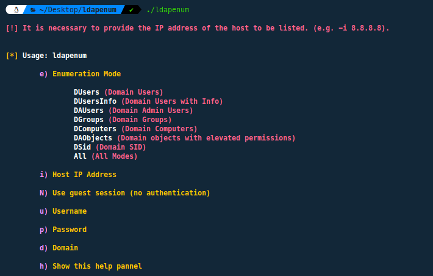
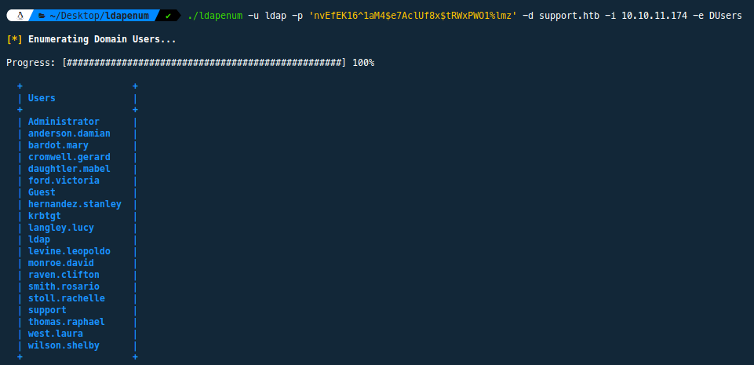
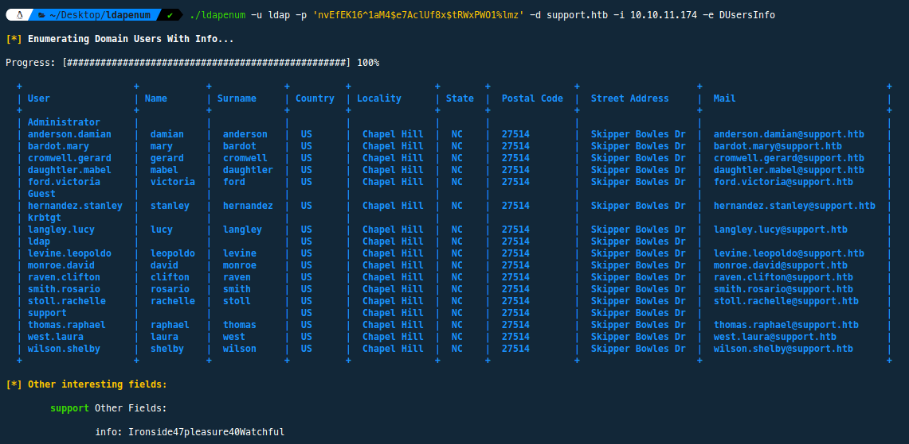
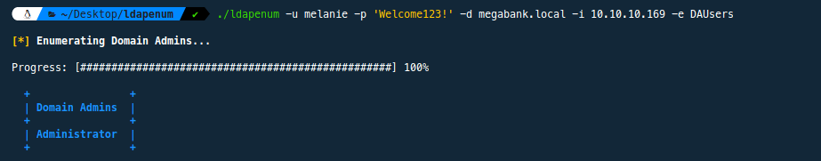
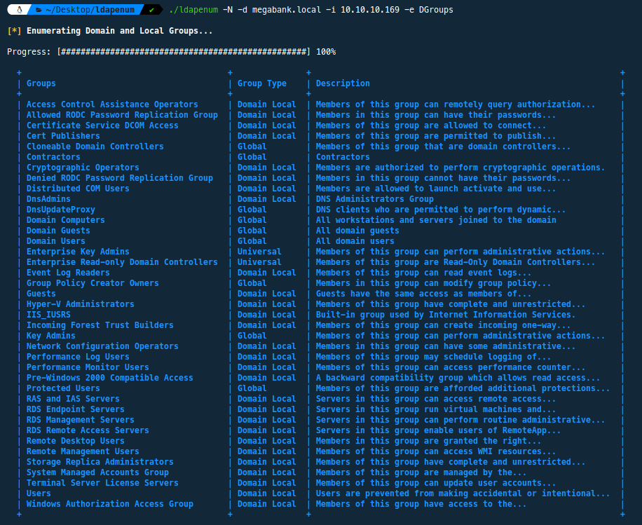
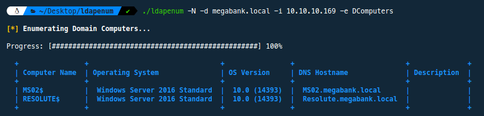
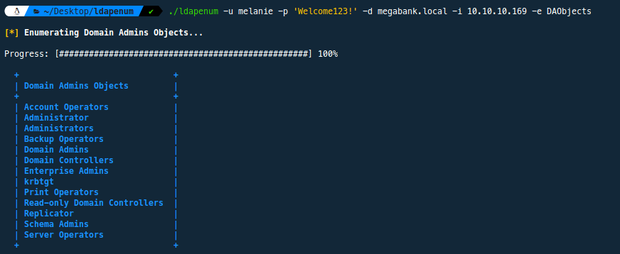
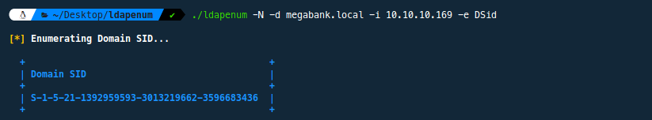

#LDAPenum

LDAPEnum es una herramienta de línea de comandos diseñada para simplificar la enumeración de servicios LDAP mediante la utilización de ldapsearch. Esta herramienta es especialmente útil para aquellos que necesitan realizar la enumeración de servicios LDAP de manera eficiente y rápida, sin tener que preocuparse por la configuración de parámetros complicados o la interpretación de resultados confusos.

Esta herramienta nos permitirá obtener la siguiente información de un servicio LDAP:

* Usuarios del dominio
* Información más relevante de los usuarios del dominio
* Grupos del dominio
* Ordenadores del dominio
* Objetos con permisos elevados en el dominio
* SID (identificador de seguridad) del dominio

Ejecución
======

```bash
git clone https://github.com/RipFran/ldapenum
cd ldapenum
chmod +x ldapenum
```

¿Cómo funciona?
======

La ejecución de la herramienta mostrará el siguiente panel de ayuda:

<p align="center">
	
</p>

Su **funcionamiento** es el siguiente:

* **Modo** de enumeración (opción -e): Se debe proporcionar el modo de enumeración que se desea utilizar.
* Dirección **IP** del host (opción -i): Se debe proporcionar la dirección IP del host que se desea enumerar.
* Dominio del host (opción -d): Se debe proporcionar el dominio del host que se desea enumerar.
* Uso de sesión **nula/invitado** **o autenticación** (opciones -N, -u, y -p):
	* Para utilizar una sesión nula (sin autenticación), utiliza la opción -N.
	* Si deseas usar credenciales de usuario, proporciona el nombre de usuario con la opción -u y la contraseña con la opción -p.

La herramienta verifica que se haya proporcionado la dirección IP del host, el dominio y el modo de enumeración. Además, comprueba si se ha especificado una sesión nula o se han proporcionado credenciales de usuario válidas.

El modo de enumeración **DUsers**, nos permitirá obtener un listado de los usuarios existentes en el dominio:

<p align="center">
	
</p>

El modo de enumeración **DUsersInfo** se utiliza para enumerar información detallada de los usuarios en un dominio. Al ejecutar esta función, la herramienta recopila y muestra información adicional sobre cada usuario del dominio, como nombre, apellido, país, localidad, estado, código postal, dirección y correo electrónico. Además, también busca y muestra otros campos interesantes que no están incluidos en la lista principal de atributos:

<p align="center">
    
</p>

El modo de enumeración **DAUsers** se utiliza para enumerar los administradores de dominio en un dominio específico:

<p align="center">
    
</p>

El modo de enumeración **DGroups**, nos permitirá obtener un listado de los grupos existentes en el dominio:

<p align="center">
    
</p>

El modo de enumeración **DComputers** se utiliza para enumerar los equipos dentro de un dominio específico. Al ejecutar esta función, el script busca y muestra información sobre los equipos en el dominio, como el nombre del equipo, el sistema operativo, la versión del sistema operativo, el nombre de host DNS y la descripción:

<p align="center">
    
</p>

El modo de enumeración **DAObjects** se utiliza para enumerar objetos dentro de un dominio que tienen el atributo *adminCount* establecido en 1, identificando así aquellos relacionados con administradores o que tienen permisos elevados en el dominio.

<p align="center">
    
</p>

El modo de enumeración **DSid** se utiliza para obtener el identificador de seguridad (SID) del dominio. Conocer el SID del dominio puede ser útil para realizar investigaciones de seguridad y auditorías en el entorno:

<p align="center">
    
</p>

Por último, el modo de enumeración **All**, nos efectuará todas las enumeraciones de forma simultánea, pudiendo así visualizar la información más relevante del dominio.

Ejemplos de uso
======

```bash
./ldapenum -u 'Administrator' -p 'P@$$w0rd!' -d r1pfr4n.local -i 192.168.47.134 -e All
./ldapenum -N -d megabank.local -i 10.10.10.169 -e DGroups
./ldapenum -u melanie -p 'Welcome123!' -d megabank.local -i 10.10.10.169 -e DAObjects
./ldapenum -u melanie -p 'Welcome123!' -d megabank.local -i 10.10.10.169 -e DSid
```